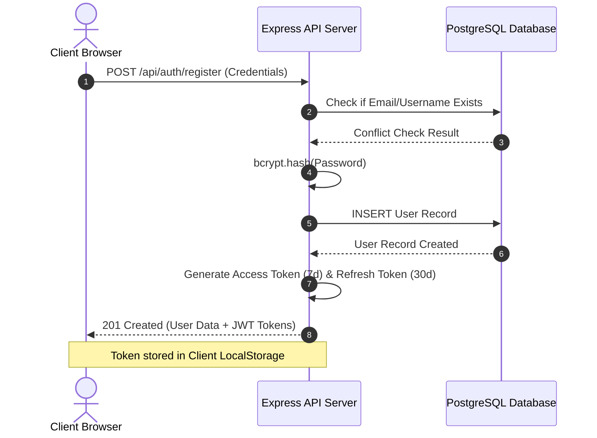
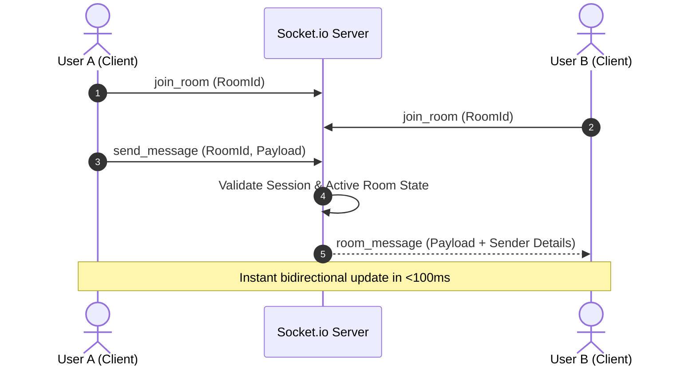

# ⚡ Pulse — Connect & Focus

Pulse is a premium, state-of-the-art, mood-driven social workspace designed to bridge the gap between human connection and deep focus. Built to counter the fragmented, noisy, and high-fatigue nature of modern social networks, Pulse dynamically customizes its interface, content delivery, and interactive spaces based on the user's active cognitive state.

---

## 📌 1. Introduction

In an era of hyper-connected noise, professionals, students, and creators constantly struggle to balance social communication with focused output. **Pulse** is an innovative platform that introduces **Mood-Based Cognitive States (Social, Focus, and Inspiration)** to curating feeds, channels, and interactive rooms. 

Instead of forcing users to adapt to constant distraction, Pulse reshapes itself around the user's focus needs. Whether you need a low-noise technical feed to complete a sprint, a burst of creative concepts to fuel a design process, or a vibrant virtual watercooler to socialize with peers, Pulse adapts dynamically to optimize your cognitive load and social well-being.

---

## 💡 2. Use Cases

### 🎯 A. Deep Work & Focus Mode
* **Scenario:** A software engineer is working on a complex feature and wants to stay updated on team announcements without being drawn into casual memes or distracting social threads.
* **Action:** The user toggles their state to **Focus**. 
* **Outcome:** The main feed instantly filters out general social posts, highlighting technical tutorials, team achievements, and industry focus articles. Casual channels are muted, and non-essential notifications are buffered to prevent disruption.

### ✨ B. Ideation & Inspiration Mode
* **Scenario:** A UI/UX designer is brainstorming concepts for a new client portal and needs visual ideas and inspiring content.
* **Action:** The user switches to **Inspiration** mode.
* **Outcome:** The feed populates with portfolio shots, visual media, design challenges, and motivational updates. 

### 💬 C. Ephemeral Pop-Up Rooms
* **Scenario:** A project team needs a quick, friction-free 24-hour brainstorming space to discuss an upcoming launch.
* **Action:** An admin creates a Pop-up Room inside their Community Hub.
* **Outcome:** Team members join a dedicated, real-time audio/chat space. The room remains active for 24 hours to host rapid collaboration and automatically self-destructs after expiry to prevent long-term clutter and archive bloat.

### 🔒 D. Secure Client-Side Encrypted Conversations
* **Scenario:** Two colleagues are discussing sensitive intellectual property or project credentials.
* **Action:** They open the **Messages** tab.
* **Outcome:** Messages are encrypted using secure keys, ensuring private discussions remain entirely confidential.

---

## 📈 3. Industry Value

Modern digital workplaces and social platforms are suffering from **Notification Fatigue** and **Context-Switching overhead**, costing businesses billions in lost productivity annually. Pulse delivers immense industry value by introducing:

1. **Cognitive Ergonomics:** By matching content filters to cognitive states, Pulse reduces stress and improves long-term focus retention.
2. **Respectful Engagement:** Eschews addictive dopamine-loop algorithms in favor of a user-centric design that actively assists users in turning off distractions when they need to work.
3. **Optimized Knowledge Flow:** Organizes community threads into distinct thematic categorizations (Focus, Inspiration, Social), making searchable knowledge accessible and organized.

---

## 👥 4. System Roles

The Pulse ecosystem supports four primary roles:

| Role | Permissions & Capabilities | Access Level |
| :--- | :--- | :--- |
| **Guest / Visitor** | Can access the landing, registration, and login portals. Restricted from posting, viewing profiles, hubs, or sending messages. | Public Level |
| **Pulse Member** | Fully authenticated user. Can toggle mood modes, publish posts with media, join Community Hubs, participate in Pop-up Rooms, follow users, and send real-time DMs. | Member Level |
| **Hub Administrator** | Community leader. Inherits all member features. Can create and customize Hubs, approve members, and configure Ephemeral Pop-up Rooms. | Management Level |
| **System Moderator** | Global administrative role. Manages platform metrics, resolves user moderation reports, and administers global accounts. | Global Admin Level |

---

## 🛠️ 5. Tech Stack & Architectural Rationale

Pulse implements a modern decoupled Client-Server architecture designed for scalability, low latency, and ease of deployment.

```
┌─────────────────────────────────────────────────────────┐
│                     CLIENT (React)                      │
│   (Vite, React Router 7, Socket.io-Client, CSS Vars)    │
└────────────────────────────┬────────────────────────────┘
                             │ (HTTPS / WebSockets)
                             ▼
┌─────────────────────────────────────────────────────────┐
│                     SERVER (Express)                    │
│      (NodeJS 24, JWT, bcryptjs, Multer, Socket.io)      │
└────────────────────────────┬────────────────────────────┘
                             │ (Prisma Client)
                             ▼
┌─────────────────────────────────────────────────────────┐
│                   DATABASE (Postgres)                   │
└─────────────────────────────────────────────────────────┘
```

### 💻 Frontend Tech Stack
* **React.js:** Selected for its modular component-based architecture, unidirectional data flow, and virtual DOM efficiency.
* **Vite:** Used as the modern frontend bundler. It provides near-instant Hot Module Replacement (HMR) and lightning-fast production builds, resolving the slow boot times of legacy setups.
* **React Router 7:** Handles SPA client-side routing, protected routes for authentication, and route parameters.
* **Vanilla CSS (Variables & Utility Classes):** Avoids massive CSS framework overhead while delivering glassmorphism effects, curated dark-mode color tokens, and custom UI micro-animations.

### ⚙️ Backend Tech Stack
* **Node.js & Express:** Delivers a lightweight, non-blocking I/O event-driven environment capable of handling high concurrent connections (essential for real-time applications).
* **Socket.io:** Powers instant, bi-directional real-time communication for direct messaging, typing indicators, and room participation.
* **Prisma ORM:** Provides an auto-migrating, fully type-safe layer to interact with the database, significantly reducing boilerplate SQL operations.
* **PostgreSQL (Production) & SQLite (Local):** PostgreSQL delivers production-grade relational power, indexing speed, and transactional reliability. SQLite offers zero-config local development.

---

## 📦 6. Technologies Used & Detailed Explanation

### 🔐 Authentication & Security
* **`jsonwebtoken` (JWT):** Generates and verifies signed stateless tokens, allowing the API server to perform secure, fast authentication checks without querying the database on every request.
* **`bcryptjs`:** Uses the industry-standard Blowfish cipher block chaining algorithm to salt and hash user passwords prior to storage, securing credentials against database breaches.
* **`cookie-parser`:** Parses cookie headers to facilitate secure session management and authorization headers.

### 📂 File Management
* **`multer`:** Middleware for handling multipart/form-data, facilitating robust profile pictures and rich post media uploads to the Express backend.

### 🎨 Design & Icons
* **`react-icons` (Heroicons / Hi2):** Provides high-resolution, lightweight SVG icons that match Pulse's premium styling.

---

## 🖥️ 7. Functionalities & User Interface

### 📱 A. The Mood Feed Portal
The central feed is governed by a mood filter toggle. Users can click between **Social**, **Focus**, and **Inspiration** to instantly filter content. 

> [!TIP]
> **Functional Screenshot:** Shows the feed switching seamlessly with interactive tabs and glassmorphic card layouts.
> *(Placeholder: Insert `feed_dashboard.png`)*

### 💬 B. Community Hubs & Ephemeral Rooms
Users can explore organized interest-based hubs and immediately launch pop-up collaboration rooms that vanish after 24 hours.

> [!TIP]
> **Functional Screenshot:** Displays the hub explorer with active Pop-up Rooms and their remaining durations.
> *(Placeholder: Insert `community_hubs.png`)*

### ✉️ C. Encrypted Direct Messaging
Real-time messaging showing typing status, online indicators, and E2E message encryption status.

> [!TIP]
> **Functional Screenshot:** Displays active conversation sidebars, typing bubbles, and dynamic online/offline indicators.
> *(Placeholder: Insert `realtime_chat.png`)*

---

## 📊 8. Architectural Flowcharts

### 🔄 User Authentication & Session Management Flow


### 💬 Real-Time Ephemeral Room Messaging Flow


---

## 🏁 9. Conclusion

**Pulse** represents a major shift in how modern social media and communication platforms are designed. By integrating state-aware filters and ephemeral real-time collaboration with a beautiful glassmorphism-based premium interface, Pulse demonstrates that social platforms can be both highly connective and deeply supportive of focused productivity. 

With its robust React client, fast Express server, type-safe Prisma backend, and production-ready PostgreSQL integration, Pulse stands as a scalable foundation for modern, health-conscious digital workspaces.
